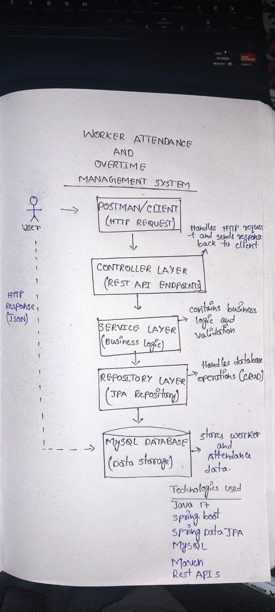

# Worker Attendance & Overtime Management System

## Project Overview
Short description

## Part 1: Feature Build
### Problem Statement
### Business Rules
### Assumptions

## Schema Design
### Worker Table
### Attendance Table

## REST APIs

### Worker APIs
POST /workers
GET /workers
GET /workers/{id}
PUT /workers/{id}
DELETE /workers/{id}

### Attendance APIs
POST /attendance
GET /attendance
GET /attendance/{id}
PUT /attendance/{id}
DELETE /attendance/{id}

## Error Handling
ResourceNotFoundException
GlobalExceptionHandler

Example Response:
{
  "message": "Worker not found with id: 999"
}

## Technologies Used
- Java 17
- Spring Boot
- Spring Data JPA
- MySQL
- Maven
- Postman
- GitHub

## Project Structure
controller
service
repository
entity
exception

## How to Run
1. Clone repository
2. Configure MySQL
3. Run WorkerManagementSystemApplication
4. Test APIs using Postman

## Hand Drawn Diagram

## Future Enhancements
- Validation
- Swagger
- Authentication
